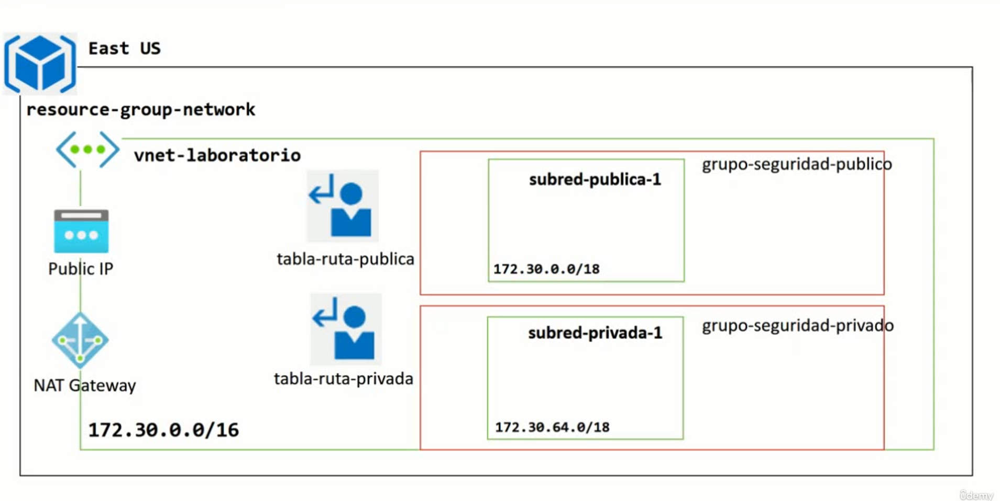

# ☁️ Terraform Azure Network Lab

Este proyecto implementa una red pública básica en **Microsoft Azure** utilizando **Terraform**. Forma parte de una serie de laboratorios prácticos para aprender Infraestructura como Código (IaC).

---

## 📐 Arquitectura

El siguiente diagrama muestra la arquitectura desplegada:

---

## 📁 Estructura del proyecto

---

## 🚀 ¿Qué despliega este proyecto?

- 📡 Una **Virtual Network (VNet)**
- 🌐 Una **subred pública**
- 🔁 Una **tabla de rutas públicas** (public route table)
- 🔒 Un **Network Security Group (NSG http y ssh inbound)**
- 🔗 Asociaciones entre recursos

---

## 📦 Requisitos

- Cuenta de Azure activa
- Terraform ≥ 1.0
- Azure CLI configurado (`az login`)
- Permisos para crear recursos en una suscripción
